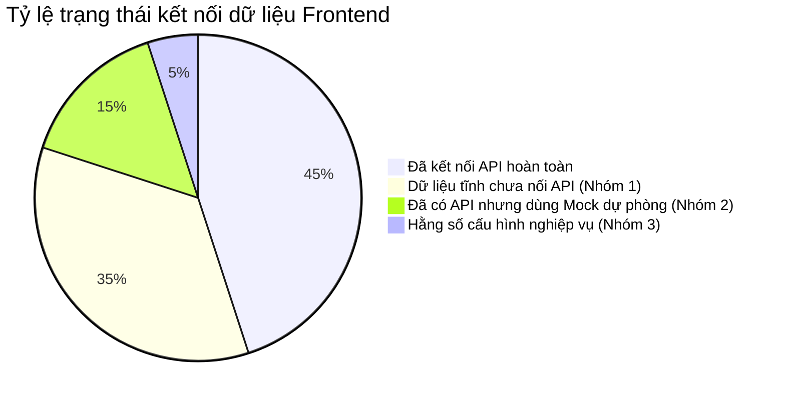

# BÁO CÁO RÀ SOÁT DỮ LIỆU TĨNH (HARDCODE) & KẾ HOẠCH ĐỒNG BỘ HÓA API TOÀN HỆ THỐNG

**Hệ thống E-Learning & Khảo thí Aptis ESOL (Aptis Kỳ Tích)**  
*Ngày lập báo cáo: 27/09/2026*  
*Người lập: Antigravity AI Engineer & Engineering Team*

---

## 📌 TÓM TẮT ĐIỀU HÀNH (EXECUTIVE SUMMARY)

Sau đợt rà soát toàn diện mã nguồn Frontend (Next.js 16) và Backend (Node.js/Express + Prisma PostgreSQL), hệ thống đã đạt độ hoàn thiện cao về hạ tầng, nghiệp vụ và kiểm thử (82/82 Backend Tests Pass, 25/25 Frontend Routes Compile sạch).

Tuy nhiên, trong quá trình phát triển giai đoạn Prototype/MVP, nhiều màn hình phía Học viên (Client Portal) đang sử dụng **mảng dữ liệu mẫu nội bộ (Mock Arrays / Static Fallbacks)** để phục vụ dựng giao diện. Điều này dẫn đến sự **lệch pha dữ liệu** giữa Cổng Quản trị (Admin Portal) và Cổng Học viên:
- Admin thêm/sửa đề thi, bộ từ vựng, bài vinh danh trên Database.
- Nhưng một số trang của Học viên vẫn đang đọc dữ liệu tĩnh được khai báo trực tiếp trong tệp `.tsx`.

Tài liệu này cung cấp bức tranh chi tiết về các vị trí dữ liệu tĩnh, đánh giá mức độ ảnh hưởng và lộ trình chuẩn hóa kết nối động toàn diện.

---

## 1. PHÂN LOẠI HIỆN TRẠNG DỮ LIỆU TOÀN HỆ THỐNG

Dữ liệu trên toàn bộ nền tảng hiện được chia thành 3 nhóm rõ rệt:



---

## 2. BẢNG CHI TIẾT CÁC VỊ TRÍ CẦN CHUYỂN ĐỔI

### 🔴 NHÓM 1: CÁC TRANG HỌC VIÊN ĐANG DÙNG MẢNG TĨNH (CHƯA NỐI API)
*Các trang này hiển thị dữ liệu tĩnh độc lập, chưa phản ánh các thay đổi mà Admin thực hiện trong cơ sở dữ liệu.*

| STT | Màn hình chức năng | Tuyến đường (Route) | Tệp nguồn Frontend | Biến tĩnh đang khai báo | API Backend đã sẵn sàng | Mức độ ưu tiên |
| :---: | :--- | :--- | :--- | :--- | :--- | :---: |
| **1** | **Phòng Luyện Đề Nghe** | `/listening` | `src/app/listening/page.tsx` | `mockListeningExams` (6 đề mẫu) | `GET /api/exams?skill=LISTENING` | **Cao (P1)** |
| **2** | **Phòng Luyện Đề Nói** | `/speaking` | `src/app/speaking/page.tsx` | `mockSpeakingExams` (5 đề mẫu) | `GET /api/exams?skill=SPEAKING` | **Cao (P1)** |
| **3** | **Phòng Luyện Đề Đọc** | `/reading` | `src/app/reading/page.tsx` | `mockReadingExams` (6 đề mẫu) | `GET /api/exams?skill=READING` | **Cao (P1)** |
| **4** | **Phòng Luyện Đề Viết** | `/writing` | `src/app/writing/page.tsx` | `mockWritingExams` (5 đề mẫu) | `GET /api/exams?skill=WRITING` | **Cao (P1)** |
| **5** | **Luyện Grammar & Vocab** | `/grammar` | `src/app/grammar/page.tsx` | `mockExams` (8 đề mẫu) | `GET /api/exams?skill=GRAMMAR_VOCABULARY` | **Cao (P1)** |
| **6** | **Ngân hàng Từ vựng Học viên** | `/vocabulary` | `src/app/vocabulary/page.tsx` | `mockTopics` (8 chủ đề từ vựng) | `GET /api/vocabulary/sets` *(Admin đã có CRUD)* | **Cao (P1)** |
| **7** | **Bảng Kỳ Tích Vinh Danh** | `/bang-ky-tich` | `src/app/bang-ky-tich/page.tsx` | `mockHonors` (2 bài mẫu band C) | `GET /api/cms/hall-of-fame` | **Trung bình (P2)** |
| **8** | **Lịch sử Làm Bài Học Viên** | `/history` | `src/app/history/page.tsx` | `mockHistory` (3 bài nộp mẫu) | `GET /api/submissions/my-history` | **Cao (P1)** |
| **9** | **Kho Đề Key Dự Đoán** | `/key-du-doan` | `src/app/key-du-doan/page.tsx` | `mockKeySets` (4 bộ đề tháng 9) | `GET /api/exams?isKey=true` | **Trung bình (P2)** |
| **10** | **Nghe Chép Chính Tả** | `/nghe-chep` | `src/app/nghe-chep/page.tsx` | `mockDictations` (3 câu mẫu) | `GET /api/dictation/lessons/:id` | **Trung bình (P2)** |

---

### 🟡 NHÓM 2: MÀN HÌNH ĐÃ GỌI API THỰC TẾ NHƯNG CÓ MẢNG DỰ PHÒNG (FALLBACK)
*Các trang này đã tích hợp gọi Backend. Mảng tĩnh trong code chỉ đóng vai trò dữ liệu mẫu dự phòng khi Database rỗng hoặc khi mất kết nối mạng.*

| Màn hình | Tệp nguồn | Cơ chế hoạt động hiện tại | Đánh giá |
| :--- | :--- | :--- | :--- |
| **Thi thử Full Test (`/thi-thu`)** | `src/app/thi-thu/page.tsx` | Gọi `api.exams.getAll({ limit: 12 })`. Nếu DB có dữ liệu thì ghi đè `mockTests`. | **Đạt chuẩn.** Giữ nguyên mảng tĩnh làm Fallback UI. |
| **Bảng Giá Gói Học (`/pricing`)** | `src/app/pricing/page.tsx` | Gọi `api.payment.getPlans()`. Ánh xạ giá và quyền lợi động từ Database. | **Đạt chuẩn.** Mảng `defaultPlans` chỉ là trạng thái ban đầu khi chờ fetch. |
| **Nạp tiền thủ công (`/admin/transactions`)** | `src/app/admin/transactions/page.tsx` | **Vừa nâng cấp:** Đã xóa bỏ 3 nút hardcode `199k/499k/999k`. Load 100% động từ `api.admin.getPlans()`. | **Đạt chuẩn xuất sắc.** Đồng bộ với Quản lý Gói cước. |

---

### 🟢 NHÓM 3: HẰNG SỐ CẤU HÌNH NGHIỆP VỤ (BUSINESS CONSTANTS)
*Các thông số này được quy định bởi trung tâm và hội đồng khảo thí theo tài liệu đặc tả:*

1. **Thông tin Tài khoản Ngân hàng (SePay / VietQR):**
   * Ngân hàng nhận: `MB Bank (Quân Đội)`
   * Số tài khoản: `0866950837`
   * Tên thụ hưởng: `APTIS ESOL PREMIER`
   * *Khuyến nghị:* Nên chuyển vào biến môi trường `process.env.NEXT_PUBLIC_BANK_ACCOUNT` và `BANK_ACCOUNT` ở Backend thay vì gán chuỗi trong code.
2. **Khung thời gian gia hạn nhanh tại Admin Users (`/admin/users`):**
   * Các mốc: `+7 ngày`, `+30 ngày`, `+90 ngày`, `+180 ngày`.
   * *Đánh giá:* Đây là các nút tắt tác nghiệp (Shortcuts) tiện lợi cho nhân viên học vụ, hợp lý và không cần sửa.

---

## 3. RỦI RO VẬN HÀNH KHI CHƯA ĐỒNG BỘ API

1. **Bất đồng bộ nội dung đào tạo:** Admin biên tập đề thi hoặc thêm tranh miêu tả Speaking mới trong `/admin/exams`, nhưng học viên vào phòng `/speaking` vẫn chỉ thấy 5 đề cũ do trang đang lấy từ `mockSpeakingExams`.
2. **Sai lệch từ vựng:** Đội ngũ học vụ nhập 200 từ vựng chuyên sâu vào `/admin/vocabulary`, nhưng học viên truy cập `/vocabulary` không nhìn thấy các từ vựng mới này.
3. **Lịch sử học tập không cập nhật:** Sau khi nộp bài thi thử, học viên vào `/history` lại chỉ thấy 3 bài nộp giả lập (`mockHistory`) thay vì danh sách các lần nộp bài thực tế của chính mình.

---

## 4. LỘ TRÌNH TRIỂN KHAI ĐỒNG BỘ HÓA (ROADMAP)

### Giai đoạn 1: Đồng bộ 5 Phòng Luyện Kỹ Năng Đơn (Ưu tiên P1)
- **Mục tiêu:** Chuyển đổi `/listening`, `/speaking`, `/reading`, `/writing`, `/grammar`.
- **Cách thực hiện:**
  ```tsx
  useEffect(() => {
    async function loadExams() {
      try {
        setLoading(true);
        const res = await api.exams.getAll({ skill: "LISTENING" }); // hoặc SPEAKING, READING...
        if (res.success && res.data && res.data.length > 0) {
          setExams(res.data);
        }
      } finally {
        setLoading(false);
      }
    }
    loadExams();
  }, []);
  ```
- **Thời gian ước tính:** 1 - 2 giờ.

### Giai đoạn 2: Đồng bộ Kho Từ Vựng & Bảng Kỳ Tích (Ưu tiên P1 & P2)
- **Mục tiêu:**
  - Nối trang `/vocabulary` học viên với `api.vocabulary.getSets()`.
  - Nối trang `/bang-ky-tich` với `api.cms.getHallOfFame()`.
- **Thời gian ước tính:** 1 giờ.

### Giai đoạn 3: Đồng bộ Lịch Sử Bài Nộp Cá Nhân `/history` (Ưu tiên P1)
- **Mục tiêu:** Viết endpoint Backend `GET /api/submissions/my-history` và nối vào bảng hiển thị điểm số của học viên tại `/history`.
- **Thời gian ước tính:** 1 giờ.

### Giai đoạn 4: Chuyển Thông Tin Ngân Hàng Thành Biến Môi Trường (P3)
- Đưa số tài khoản MB Bank và Tên thụ hưởng vào file `.env` ở cả Frontend và Backend để tiện thay đổi tài khoản khi đổi chi nhánh hoặc đổi người đại diện pháp lý.

---

## 5. KẾT LUẬN & KIẾN NGHỊ

Hệ thống đã có đầy đủ nền tảng Database, Prisma Schema và Backend RESTful API hoàn chỉnh (đã pass toàn bộ 82 integration tests). Việc chuyển đổi từ mảng tĩnh (mock) sang API động hoàn toàn là công việc ở tầng hiển thị của Frontend (UI Data Binding), có thể tiến hành từng bước một cách an toàn mà không làm gián đoạn các tính năng đang hoạt động.
