# ĐẶC TẢ KỸ THUẬT: CHUẨN HÓA DỮ LIỆU ĐỘNG & BẢNG MA TRẬN ĐỒNG BỘ HÓA API TOÀN HỆ THỐNG

**Dự án:** Hệ thống Luyện thi & Khảo thí Trực tuyến Aptis ESOL (Aptis Kỳ Tích)  
**Tiêu chuẩn:** Nghiêm ngặt theo Đặc tả Nghiệp vụ (`docs/Bao_Cao_Dac_Ta_Chuc_Nang_Elearning_Aptis.md`), Thiết kế Hệ thống (`docs/backend-system-design.md`) và Thiết kế Giao diện Quản trị (`docs/admin-ui-ux-design.md`).  
**Nguyên tắc triển khai:** *"Code tiến, không code lùi"* — Chuẩn hóa kiểu dữ liệu TypeScript, đồng bộ 100% giữa Zod DTO Backend và Frontend API Client, bảo toàn tính ổn định và tính khả dụng của UI (Zero-Downtime & Graceful Fallback).

---

## 1. BẢN ĐỒ KIẾN TRÚC DỮ LIỆU & LUỒNG ĐỒNG BỘ (DATA ARCHITECTURE)

```mermaid
graph TD
    subgraph Database["PostgreSQL / Prisma Database"]
        DB_Exams[(Exams & Questions)]
        DB_Submissions[(Exam Submissions)]
        DB_Plans[(Subscription Plans)]
        DB_Vocab[(Vocab Sets & Words)]
        DB_CMS[(CMS Reviews & HallOfFame)]
        DB_Dictation[(Dictation Lessons)]
    end

    subgraph BackendAPI["Backend Express RESTful Services (Port 5000)"]
        API_Exams["/api/exams (GET, POST custom)"]
        API_Submissions["/api/submissions (Start, Submit, History)"]
        API_Plans["/api/payment/plans & /api/admin/plans"]
        API_Vocab["/api/vocabulary/sets & words"]
        API_CMS["/api/cms/hall-of-fame & reviews"]
        API_Dictation["/api/dictation/levels & lessons"]
    end

    subgraph AdminPortal["Admin Portal (/admin/*)"]
        Admin_Exams["/admin/exams (CRUD Đề thi)"]
        Admin_Transactions["/admin/transactions (Khớp lệnh & Giao dịch)"]
        Admin_Plans["/admin/cms (Quản lý Gói cước VIP)"]
        Admin_Vocab["/admin/vocabulary (CRUD Bộ từ vựng)"]
        Admin_Reviews["/admin/reviews (Duyệt bài đánh giá)"]
    end

    subgraph ClientPortal["Student / Public Portal"]
        Client_Skills["5 Phòng Kỹ Năng: Listening, Speaking, Reading, Writing, Grammar"]
        Client_ExamRoom["/thi-thu (Phòng thi Full Test)"]
        Client_Vocab["/vocabulary (Kho Từ vựng 198 bộ)"]
        Client_History["/history (Lịch sử làm bài cá nhân)"]
        Client_HallOfFame["/bang-ky-tich (Bảng vinh danh Band C)"]
        Client_Pricing["/pricing (Bảng giá nạp thẻ VietQR)"]
    end

    DB_Exams <--> API_Exams
    DB_Submissions <--> API_Submissions
    DB_Plans <--> API_Plans
    DB_Vocab <--> API_Vocab
    DB_CMS <--> API_CMS
    DB_Dictation <--> API_Dictation

    Admin_Exams --> API_Exams
    Admin_Transactions --> API_Plans
    Admin_Plans --> API_Plans
    Admin_Vocab --> API_Vocab
    Admin_Reviews --> API_CMS

    API_Exams -.->|CẦN KẾT NỐI ĐỘNG| Client_Skills
    API_Exams ===|ĐÃ KẾT NỐI| Client_ExamRoom
    API_Plans ===|ĐÃ KẾT NỐI| Client_Pricing
    API_Vocab -.->|CẦN KẾT NỐI ĐỘNG| Client_Vocab
    API_Submissions -.->|CẦN KẾT NỐI ĐỘNG| Client_History
    API_CMS -.->|CẦN KẾT NỐI ĐỘNG| Client_HallOfFame
```



---

## 2. MA TRẬN ĐỐI SOÁT CHI TIẾT TỪNG VỊ TRÍ HARDCODE (EXACT CODE AUDIT)

Qua đối soát từng dòng mã nguồn, dưới đây là bảng định vị chính xác vị trí mảng tĩnh, kiểu dữ liệu và sai lệch kỹ thuật:

| STT | Màn hình & Tệp nguồn | Dữ liệu tĩnh hiện tại | Sai lệch kỹ thuật giữa Frontend và Backend | API Backend chuẩn xác |
| :---: | :--- | :--- | :--- | :--- |
| **1** | **Phòng Nghe**<br>[`src/app/listening/page.tsx:28`](file:///d:/sontayweb/E-leaning&APTIS/frontend/src/app/listening/page.tsx#L28) | Mảng `mockListeningExams` (6 đề mẫu: `de-01` đến `de-06`). | Chưa có `useEffect` fetch dữ liệu. Trong `api-client.ts`, hàm `api.exams.getAll` truyền `type` thay vì `skill: "LISTENING"` theo `examFilterSchema`. | `GET /api/exams?skill=LISTENING&isPro=false` |
| **2** | **Phòng Nói**<br>[`src/app/speaking/page.tsx:26`](file:///d:/sontayweb/E-leaning&APTIS/frontend/src/app/speaking/page.tsx#L26) | Mảng `mockSpeakingExams` (5 đề mẫu: `de-01` đến `de-05`). | Chưa gọi API. Không hiển thị các đề Speaking mới do Admin tạo trong `/admin/exams`. | `GET /api/exams?skill=SPEAKING` |
| **3** | **Phòng Đọc**<br>[`src/app/reading/page.tsx:25`](file:///d:/sontayweb/E-leaning&APTIS/frontend/src/app/reading/page.tsx#L25) | Mảng `mockReadingExams` (6 đề mẫu). | Chưa gọi API. Danh sách hiển thị bị cô lập khỏi Database. | `GET /api/exams?skill=READING` |
| **4** | **Phòng Viết**<br>[`src/app/writing/page.tsx:26`](file:///d:/sontayweb/E-leaning&APTIS/frontend/src/app/writing/page.tsx#L26) | Mảng `mockWritingExams` (5 đề mẫu). | Chưa gọi API. Không lọc được đề PRO/FREE theo quyền tài khoản. | `GET /api/exams?skill=WRITING` |
| **5** | **Phòng Ngữ Pháp & Từ Vựng**<br>[`src/app/grammar/page.tsx:27`](file:///d:/sontayweb/E-leaning&APTIS/frontend/src/app/grammar/page.tsx#L27) | Mảng `mockExams` (8 đề mẫu: `de-01` đến `de-08`). | Chưa gọi API. Chưa đồng bộ trạng thái `status: not_started / completed`. | `GET /api/exams?skill=GRAMMAR_VOCABULARY` |
| **6** | **Từ Vựng Học Viên**<br>[`src/app/vocabulary/page.tsx:30`](file:///d:/sontayweb/E-leaning&APTIS/frontend/src/app/vocabulary/page.tsx#L30) | Mảng `mockTopics` (8 bộ từ: Animals, Clothes...). | Admin đã có đủ API CRUD Bộ từ trong Database (`/admin/vocabulary`), nhưng Học viên vẫn chỉ nhìn thấy 8 mảng tĩnh. | `GET /api/vocabulary/sets` và `GET /api/vocabulary/sets/:id/words` |
| **7** | **Bảng Kỳ Tích**<br>[`src/app/bang-ky-tich/page.tsx:34`](file:///d:/sontayweb/E-leaning&APTIS/frontend/src/app/bang-ky-tich/page.tsx#L34) | Mảng `mockHonors` (2 bài thi mẫu C1-C2). | Backend đã có endpoint `GET /api/cms/hall-of-fame`, nhưng trang Client chưa viết hàm `useEffect` gọi endpoint này. | `GET /api/cms/hall-of-fame` |
| **8** | **Lịch Sử Làm Bài**<br>[`src/app/history/page.tsx:29`](file:///d:/sontayweb/E-leaning&APTIS/frontend/src/app/history/page.tsx#L29) | Mảng `mockHistory` (3 bài nộp mẫu). | **Thiếu Endpoint Backend:** `backend/src/modules/submissions/submission.routes.ts` chưa mở route `GET /api/submissions` để thí sinh lấy danh sách bài nộp của chính mình. | Cần bổ sung `GET /api/submissions/my-history` |
| **9** | **Kho Đề Key Dự Đoán**<br>[`src/app/key-du-doan/page.tsx:31`](file:///d:/sontayweb/E-leaning&APTIS/frontend/src/app/key-du-doan/page.tsx#L31) | Mảng `mockKeySets` (4 bộ đề Key). | Cần phân loại cờ `is_key` hoặc tag trong bảng `Exam` trên Backend để bốc đúng đề Key. | `GET /api/exams?source=KEY` |
| **10** | **Nghe Chép Chính Tả**<br>[`src/app/nghe-chep/page.tsx:34`](file:///d:/sontayweb/E-leaning&APTIS/frontend/src/app/nghe-chep/page.tsx#L34) | Mảng `mockDictations` (3 câu mẫu). | Đã gọi `api.dictation.getLevels()` nhưng đoạn xử lý map dữ liệu vào state `sentences` đang bị bỏ dở (dòng 86-88). | `GET /api/dictation/lessons/:id` |

---

## 3. THIẾT KẾ KỸ THUẬT ĐỒNG BỘ CHI TIẾT (CHUẨN CODE TIẾN)

### 3.1. Chuẩn Hóa `frontend/src/lib/api-client.ts` Khớp 100% Backend DTO

#### Vấn đề hiện tại:
Trong `api-client.ts`, hàm `getAll` của module `exams` đang truyền tham số lệch chuẩn:
```typescript
// HIỆN TẠI (LỆCH DTO):
getAll: (params?: { page?: number; limit?: number; type?: string; is_free?: boolean }) => ...
```
Trong khi Backend `backend/src/modules/exams/exam.dto.ts` định nghĩa Zod Schema:
```typescript
export const examFilterSchema = z.object({
  skill: z.nativeEnum(ExamSkill).optional(),
  isPro: z.string().optional().transform((val) => (val === 'true' ? true : val === 'false' ? false : undefined)),
  source: z.enum(['WEB', 'CUSTOM']).optional().default('WEB'),
  page: z.string().optional().default('1').transform(Number),
  limit: z.string().optional().default('20').transform(Number),
});
```

#### Thiết kế sửa đổi chính xác (`api-client.ts`):
```typescript
exams = {
  getAll: (params?: {
    page?: number;
    limit?: number;
    skill?: 'FULL_TEST' | 'LISTENING' | 'READING' | 'WRITING' | 'SPEAKING' | 'GRAMMAR_VOCABULARY';
    isPro?: boolean;
    source?: 'WEB' | 'CUSTOM';
  }) => {
    const query = new URLSearchParams();
    if (params?.page) query.append('page', params.page.toString());
    if (params?.limit) query.append('limit', params.limit.toString());
    if (params?.skill) query.append('skill', params.skill);
    if (params?.isPro !== undefined) query.append('isPro', String(params.isPro));
    if (params?.source) query.append('source', params.source);
    const qs = query.toString();
    return this.request(`/exams${qs ? `?${qs}` : ''}`);
  },
  // ...
};
```

---

### 3.2. Bổ Sung Endpoint Lấy Lịch Sử Bài Thi Cá Nhân

#### A. Backend DTO & Controller (`backend/src/modules/submissions/`)
1. **Thêm phương thức vào `submission.service.ts`:**
```typescript
async getMySubmissions(userId: string, params: { page?: number; limit?: number; skill?: string }) {
  const page = Number(params.page) || 1;
  const limit = Number(params.limit) || 15;
  const skip = (page - 1) * limit;

  const where: any = { user_id: userId };
  if (params.skill && params.skill !== 'ALL') {
    where.exam = { skill: params.skill };
  }

  const [submissions, total] = await Promise.all([
    prisma.examSubmission.findMany({
      where,
      skip,
      take: limit,
      orderBy: { started_at: 'desc' },
      include: {
        exam: {
          select: {
            id: true,
            title: true,
            skill: true,
            duration_minutes: true,
          },
        },
      },
    }),
    prisma.examSubmission.count({ where }),
  ]);

  return {
    submissions: submissions.map((s) => ({
      id: s.id,
      examId: s.exam_id,
      examTitle: s.exam.title,
      skill: s.exam.skill,
      status: s.status,
      startedAt: s.started_at,
      submittedAt: s.submitted_at,
      totalScore: s.total_score,
      cefrLevel: s.cefr_level,
      durationSpentMinutes: s.submitted_at
        ? Math.round((s.submitted_at.getTime() - s.started_at.getTime()) / 60000)
        : null,
    })),
    total,
    page,
    totalPages: Math.ceil(total / limit),
  };
}
```

2. **Mount Route vào `submission.routes.ts`:**
```typescript
router.get('/my-history', authGuard, (req, res, next) =>
  submissionController.getMyHistory(req, res, next)
);
```

3. **Thêm vào `frontend/src/lib/api-client.ts`:**
```typescript
submissions = {
  // ...
  getMyHistory: (params?: { page?: number; limit?: number; skill?: string }) => {
    const query = new URLSearchParams();
    if (params?.page) query.append('page', params.page.toString());
    if (params?.limit) query.append('limit', params.limit.toString());
    if (params?.skill && params.skill !== 'all') query.append('skill', params.skill);
    const qs = query.toString();
    return this.request(`/submissions/my-history${qs ? `?${qs}` : ''}`);
  },
};
```

---

### 3.3. Chuẩn Hóa 5 Màn Hình Đề Thi Kỹ Năng Đơn (Design Pattern: Graceful Degradation)

Để tuân thủ tuyệt đối quy tắc **"Code tiến không code lùi"**, khi chuyển sang gọi API động, chúng ta áp dụng cơ chế:
1. Giao diện luôn khởi tạo với dữ liệu chuẩn.
2. `useEffect` gọi API Backend.
3. Nếu Database đã có dữ liệu đề thi -> **Ưu tiên hiển thị dữ liệu thật từ Database**.
4. Nếu Database chưa có đề thi của kỹ năng đó (ví dụ DB mới khởi tạo) -> **Tự động giữ mảng dữ liệu mẫu (Fallback UI)** để người dùng không bao giờ gặp lỗi giao diện rỗng (Empty State).

#### Minh họa mẫu áp dụng cho `src/app/listening/page.tsx`:
```tsx
export default function ListeningPracticePage() {
  const [exams, setExams] = useState<ListeningExam[]>(mockListeningExams);
  const [loading, setLoading] = useState(false);

  useEffect(() => {
    async function fetchListeningExams() {
      try {
        setLoading(true);
        const res = await api.exams.getAll({ skill: "LISTENING", limit: 20 });
        if (res.success && res.data && res.data.exams && res.data.exams.length > 0) {
          const mapped: ListeningExam[] = res.data.exams.map((item: any) => ({
            id: item.id,
            title: item.title,
            parts: `Part 1 - ${item.totalParts || 4}`,
            questionsCount: item.totalQuestions || 17,
            duration: `${item.durationMinutes || 35} phút`,
            isFree: !item.isPro,
            status: "not_started",
          }));
          setExams(mapped);
        }
      } catch (err) {
        console.error("Lỗi tải đề thi Listening:", err);
      } finally {
        setLoading(false);
      }
    }
    fetchListeningExams();
  }, []);

  // ... Render giao diện mượt mà
}
```

*Áp dụng hoàn toàn tương tự cho:*
- `/speaking`: `skill: "SPEAKING"`
- `/reading`: `skill: "READING"`
- `/writing`: `skill: "WRITING"`
- `/grammar`: `skill: "GRAMMAR_VOCABULARY"`

---

### 3.4. Chuẩn Hóa Kho Từ Vựng Học Viên (`src/app/vocabulary/page.tsx`)

#### Cơ chế đồng bộ với `/admin/vocabulary`:
- Admin tạo/sửa Bộ từ trong `/admin/vocabulary` -> Lưu vào bảng `VocabSet` và `VocabWord`.
- Phía Học viên `/vocabulary`:
  ```tsx
  useEffect(() => {
    async function loadVocabSets() {
      try {
        const res = await api.vocabulary.getSets();
        if (res.success && res.data && res.data.length > 0) {
          const mappedTopics: VocabTopic[] = res.data.map((s: any) => ({
            id: s.id,
            name: s.title.toUpperCase(),
            category: s.category || "APTIS GENERAL",
            wordCount: s.words?.length || s.total_words || 0,
            sampleWords: (s.words || []).slice(0, 4).map((w: any) => ({
              word: w.word,
              pos: "n/adj",
              ipa: w.phonetic || "",
              meaning: w.meaning_vi,
              example: w.example_sentence || "",
            })),
          }));
          setTopics(mappedTopics);
        }
      } catch (err) {
        console.error("Lỗi tải bộ từ vựng:", err);
      }
    }
    loadVocabSets();
  }, []);
  ```

---

### 3.5. Chuẩn Hóa Bảng Kỳ Tích (`src/app/bang-ky-tich/page.tsx`)

- Gọi `api.cms.getHallOfFame()`:
- Backend trả về danh sách các bài thi xuất sắc được lưu trữ trong Database.
- Frontend tự động render bài viết mẫu Band C thực tế của học viên.

---

## 4. KẾ HOẠCH TRIỂN KHAI TỪNG BƯỚC (STEP-BY-STEP EXECUTION)

```
Bước 1: Cập nhật api-client.ts (Thêm tham số skill, isPro cho exams.getAll).
   │
Bước 2: Bổ sung endpoint GET /api/submissions/my-history trong Backend & Test qua Supertest.
   │
Bước 3: Đồng bộ 5 trang đề thi (/listening, /speaking, /reading, /writing, /grammar).
   │
Bước 4: Đồng bộ trang /vocabulary học viên với api.vocabulary.getSets().
   │
Bước 5: Đồng bộ trang /bang-ky-tich với api.cms.getHallOfFame().
   │
Bước 6: Đồng bộ trang /history với api.submissions.getMyHistory().
   │
Bước 7: Chạy kiểm thử toàn diện: Backend tests (npm test) & Frontend build (npm run build).
```

---

## 5. CAM KẾT ĐẢM BẢO CHẤT LƯỢNG (QA & REGRESSION GUARD)

1. **Không phá vỡ cấu trúc CSS/UI:** Giữ nguyên 100% giao diện Cyber Glass-Tech, màu sắc nhận diện ngọn lửa đỏ - vàng kim và toàn bộ animation hiện tại.
2. **Không làm hỏng luồng làm bài thi:** Các tham số `id` đề thi khi truyền vào URL `/listening/[id]`, `/speaking/[id]`... tiếp tục tương thích với cả đề trong DB lẫn đề mẫu.
3. **Bảo mật tuyệt đối:** Lịch sử bài nộp cá nhân và quyền truy cập bài thi PRO được kiểm soát chặt chẽ bởi JWT AuthGuard và RoleGuard, triệt tiêu nguy cơ IDOR.
