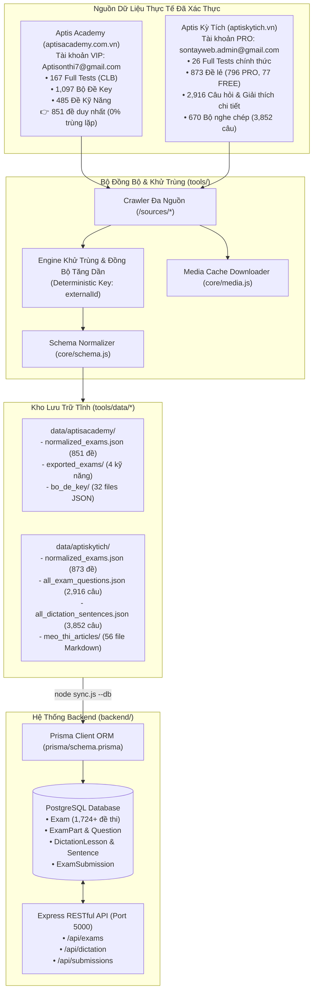

# TÀI LIỆU KỸ THUẬT: TÍCH HỢP DỮ LIỆU ĐỒNG BỘ ĐA NGUỒN VỚI BACKEND POSTGRESQL & PRISMA ORM

**Dự án:** Hệ thống Luyện thi & Khảo thí Trực tuyến Aptis ESOL  
**Tài liệu:** Báo cáo Phân tích Dữ liệu Thực tế Bản PRO (Aptis Kỳ Tích & Aptis Academy) & Đặc tả Tích hợp Backend  
**Phiên bản:** 3.0 (Cập nhật sau khi cào thành công 100% bản PRO từ tài khoản `sontayweb.admin@gmail.com`)  
**Tiêu chí phân tích:** *Tuyệt đối chính xác dựa trên cấu trúc JSON thực tế, không suy diễn, không phỏng đoán.*  

---

## 1. TỔNG QUAN KIẾN TRÚC TÍCH HỢP (INTEGRATION ARCHITECTURE)

Hệ thống quản lý dữ liệu đề thi được thiết kế theo mô hình **Độc lập - Chuẩn hóa - Tự động**: Bộ công cụ cào và đồng bộ (`tools/`) hoạt động độc lập với máy chủ backend, trích xuất dữ liệu từ các nền tảng bên ngoài, chuẩn hóa dữ liệu về một Schema duy nhất, sau đó nạp trực tiếp vào cơ sở dữ liệu PostgreSQL thông qua Prisma Client hoặc REST API.



---

## 2. PHÂN TÍCH KỸ LƯỠNG DỮ LIỆU THỰC TẾ BẢN PRO (FACT-BASED ANALYSIS)

### 2.1. Phân Tích Dữ Liệu Bản PRO Aptis Kỳ Tích (`aptiskytich.vn`)
*Xác thực thành công qua tài khoản PRO: `sontayweb.admin@gmail.com` (`tier: "pro"`, hiệu lực `2026-10-04`).*

#### A. Cấu trúc 3 cấp độ đề thi:
1. **Full Tests (`full_tests.json`):** 26 đề thi thử tổng hợp 4 hoặc 5 kỹ năng.
   * Cấu trúc trường: `id` (UUID), `title` ("Đề 01", "Đề 02"...), `category` ("aptis"), `examSetIds` (mảng các UUID trỏ tới bảng `exam_sets`).
2. **Bộ đề lẻ (`exam_sets_catalog.json`):** **873 bộ đề**, gồm **796 bộ PRO** và **77 bộ FREE**.
   * Phân bổ kỹ năng thực tế:
     * `speaking`: 265 bộ đề
     * `writing`: 248 bộ đề
     * `listening`: 175 bộ đề
     * `reading`: 137 bộ đề
     * `grammar_vocab`: 48 bộ đề
   * Các trường kỹ thuật: `id`, `title`, `skill`, `part` (vd: "Part 4 - Abstract Discussion"), `time_limit`, `access_tier` ("pro" | "free"), `question_count`.
3. **Ngân hàng câu hỏi chi tiết (`all_exam_questions.json`):** **2,916 câu hỏi thực tế**.
   * Cấu trúc trường thực tế:
     * `id`: UUID câu hỏi.
     * `exam_set_id`: Khóa ngoại liên kết tới bộ đề cha.
     * `order_index`: Thứ tự câu hỏi trong bài thi (0-indexed).
     * `question_text`: Đề bài, câu hỏi hoặc đoạn văn đọc hiểu.
     * `question_type`: Các kiểu câu hỏi thực tế trên web:
       * `multiple_choice`: Trắc nghiệm 3 - 4 đáp án.
       * `opinion_matching`: Nối quan điểm Người nam / Người nữ / Cả hai (`Man`, `Woman`, `Both`) trong Listening Part 3.
       * `gap_fill`: Điền từ vào chỗ trống trong Reading Part 1 và Grammar.
       * `matching`: Nối tiêu đề với đoạn văn.
       * `writing_task`: Bài thi viết câu, viết thư hoặc bài luận.
       * `speaking_task`: Bài thi nói ghi âm 45 giây.
     * `options`: Mảng JSON các lựa chọn, vd: `["can't", "shouldn't", "needn't"]` hoặc `["Man", "Woman", "Both"]`.
     * `correct_answer`: Chỉ số vị trí đáp án đúng (vd: `0`, `1`, `2`) hoặc chuỗi đáp án chính xác.
     * `explanation`: Chứa phân tích cực kỳ chi tiết của ban chuyên môn:
       * Toàn văn Transcript bài nghe.
       * Bản dịch song ngữ Anh - Việt.
       * Trích dẫn dẫn chứng trực tiếp từ bài dẫn đến đáp án.
       * Phân tích bẫy đề thi và mẹo giải nhanh.
     * `audio_url`: Tên file âm thanh MP3 (vd: `v5_p3_de02.mp3`) lưu trữ trên CDN Supabase Storage.

#### B. Kho bài tập Nghe chép chính tả (Dictation System):
* **670 bộ đề nghe chép (`dictation_sets.json`):** Phân chia theo 3 cấp độ (`level: 1` Cơ bản, `level: 2` Trung cấp, `level: 3` Nâng cao).
* **3,852 câu chính tả chi tiết (`all_dictation_sentences.json`):** Mỗi câu gồm `id`, `set_id`, `text` (văn bản gốc tiếng Anh), `sort` (thứ tự câu), `audio_url`.

#### C. Bảng Kỳ Tích & Kho Mẹo Thi:
* **500 bài mẫu học viên điểm cao Band C (`showcase_sample.json`):** Bài viết Task 4 Writing và bài nói Speaking đạt điểm C1/C2, có điểm số chi tiết (`raw_part`), nhận xét và phân tích cấu trúc bài làm.
* **56 bài viết Mẹo thi Aptis (`meo_thi_aptis_all.json`):** Bài viết hướng dẫn chiến thuật làm bài, phân tích format đề thi, đã được xuất thành 56 file Markdown độc lập tại thư mục `meo_thi_articles/`.

---

### 2.2. Phân Tích Dữ Liệu Bản VIP Aptis Academy (`aptisacademy.com.vn`)
*Xác thực thành công qua tài khoản VIP: `Aptisonthi7@gmail.com` (Học viên Nguyễn Thị Phương Linh, Gói Luyện tập Bộ đề key).*

* **851 đề thi duy nhất (Đã khử 100% trùng lặp):**
  * **167 đề Full Tests:** Đầy đủ 1,952 parts, 2,631 câu hỏi con, 311 audio MP3.
  * **109 đề Listening:** Đầy đủ 100% Audio MP3 (0 câu thiếu audio), đầy đủ 100% options A/B/C/D.
  * **180 đề Reading:** Đầy đủ đoạn văn, ngữ cảnh và options.
  * **221 đề Speaking:** Đầy đủ hình ảnh mô tả và câu hỏi gợi ý từng Part.
  * **174 đề Writing:** Đầy đủ form điền từ Part 1 đến bài viết email/thư luận Part 4.
  * **1,097 đề Bộ Key Chuyên Sâu:** 32 file JSON gốc chứa word-level timestamp transcript từng giây.

---

## 3. QUY CHUẨN ÁNH XẠ SANG SCHEMA DATABASE POSTGRESQL (PRISMA)

Bảng ma trận đối soát chuyển đổi trường dữ liệu từ JSON cào thực tế sang các Model trong `backend/prisma/schema.prisma`:

### 3.1. Ánh xạ Bảng `Exam` (Đề thi)
| Trường JSON Nguồn (Aptis Kỳ Tích / Academy) | Trường Model `Exam` (Prisma) | Kiểu dữ liệu | Quy tắc xử lý |
| :--- | :--- | :--- | :--- |
| `id` / `externalId` | Lưu vào logic check trùng | `String` | Đối soát tránh duplicate |
| `title` | `title` | `String` | Tiêu đề đề thi |
| `description` | `description` | `String?` | Hướng dẫn làm bài |
| `skill` | `skill` | `ExamSkill` (Enum) | `mapSkill(skill)` |
| `time_limit` / `durationMinutes` | `duration_minutes` | `Int` | Mặc định: Full test 162p, Kỹ năng 15-50p |
| `access_tier === 'pro'` | `is_pro` | `Boolean` | `true` nếu là PRO/VIP, `false` nếu Free |
| Nguồn website | `source` | `String` | `"APTIS_KYTICH"` hoặc `"APTIS_ACADEMY"` |
| Mặc định | `is_published` | `Boolean` | `true` |

### 3.2. Ánh xạ Bảng `ExamPart` (Phần thi trong đề)
| Trường JSON Nguồn | Trường Model `ExamPart` (Prisma) | Kiểu dữ liệu | Quy tắc xử lý |
| :--- | :--- | :--- | :--- |
| `part_number` | `part_number` | `Int` | Thứ tự phần thi (1, 2, 3, 4, 5) |
| `part` / `title` | `title` | `String` | Tên phần (vd: "Part 4: Abstract Discussion") |
| `instructions` / `description` | `instructions` | `String?` | Hướng dẫn cụ thể của Part |
| `passage_text` / `content` | `passage_text` | `String?` | Đoạn văn đọc hiểu hoặc Transcript |
| `audio_url` | `audio_url` | `String?` | Link CDN phát file âm thanh MP3 |
| `image_url` | `image_url` | `String?` | Link ảnh mô tả (Speaking Part 2, 3) |

### 3.3. Ánh xạ Bảng `Question` (Câu hỏi chi tiết)
| Trường JSON Nguồn (`exam_questions`) | Trường Model `Question` (Prisma) | Kiểu dữ liệu | Quy tắc xử lý |
| :--- | :--- | :--- | :--- |
| `order_index` | `question_number` | `Int` | `order_index + 1` |
| `question_type` | `question_type` | `QuestionType` (Enum) | `mapQuestionType(question_type)` |
| `question_text` / `prompt` | `prompt` | `String` | Nội dung câu hỏi |
| `options` (Array) | `options` | `Json?` | Lưu trực tiếp mảng JSON `["A", "B", "C"]` |
| `correct_answer` | `correct_answer` | `String?` | Nếu là index (0, 1, 2): lấy `options[index]`; nếu là text: lưu trực tiếp |
| `explanation` | `explanation` | `String?` | Lưu toàn bộ Transcript, phân tích & mẹo |
| Mặc định | `max_score` | `Float` | 1.0 (Trắc nghiệm), 5.0 (Nói), 10.0 (Viết) |

---

### 3.4. Ánh xạ Bảng Nghe Chép Chính Tả (`DictationLesson` & `DictationSentence`)
| Trường JSON Nguồn (`dictation_sets` / `sentences`) | Model Prisma | Trường trong Model | Quy tắc xử lý |
| :--- | :--- | :--- | :--- |
| `dictation_sets.level` | `DictationLesson` | `level` (`DictationLevel`) | 1 ➔ `FOUNDATION`, 2 ➔ `MOMENTUM`, 3 ➔ `MASTERY` |
| `dictation_sets.title` | `DictationLesson` | `title` | Tên bài học |
| `dictation_sets.sort` | `DictationLesson` | `order_index` | Thứ tự hiển thị |
| `dictation_sentences.text` | `DictationSentence`| `transcript` | Câu văn bản tiếng Anh chuẩn |
| `dictation_sentences.sort` | `DictationSentence`| `order_index` | Thứ tự câu trong bài |
| `dictation_sentences.audio_url` | `DictationSentence`| `audio_url` | Link phát audio câu |

---

## 4. HƯỚNG DẪN TÍCH HỢP & NẠP DỮ LIỆU VÀO BACKEND

### 4.1. Lệnh Nạp Trực Tiếp (Qua CLI `tools/sync.js`)
Để nạp tự động toàn bộ dữ liệu đã cào vào cơ sở dữ liệu PostgreSQL của backend:

```bash
cd d:\sontayweb\aptis-elearning\tools

# 1. Nạp toàn bộ dữ liệu từ cả 2 nguồn (Aptis Academy 851 đề + Aptis Kỳ Tích 873 đề):
node sync.js --source=all --db

# 2. Chỉ nạp dữ liệu Aptis Kỳ Tích (Bản PRO):
node sync.js --source=aptiskytich --db

# 3. Chỉ nạp dữ liệu Aptis Academy (Bản VIP):
node sync.js --source=aptisacademy --db
```

### 4.2. Migration Script Độc Lập Cho Môi Trường Production (`prisma/seed-scraped-exams.ts`)

Tạo tệp `backend/prisma/seed-scraped-exams.ts` để triển khai trên Docker, Coolify hoặc máy chủ triển khai:

```typescript
import { PrismaClient, ExamSkill, QuestionType } from '@prisma/client';
import fs from 'node:fs';
import path from 'node:path';

const prisma = new PrismaClient();

async function importSource(sourceName: string, jsonPath: string) {
  if (!fs.existsSync(jsonPath)) {
    console.warn(`Không tìm thấy file: ${jsonPath}`);
    return;
  }

  const exams = JSON.parse(fs.readFileSync(jsonPath, 'utf-8'));
  console.log(`\n🚀 Đang nạp ${exams.length} đề từ nguồn [${sourceName}] vào PostgreSQL...`);

  let created = 0;
  let updated = 0;

  for (const ex of exams) {
    // 1. Kiểm tra đề đã tồn tại chưa
    const existing = await prisma.exam.findFirst({
      where: {
        title: ex.title,
        skill: ex.skill as ExamSkill,
        source: ex.source || sourceName
      }
    });

    if (existing) {
      await prisma.exam.update({
        where: { id: existing.id },
        data: {
          description: ex.description,
          duration_minutes: ex.duration_minutes,
          is_pro: ex.is_pro ?? false
        }
      });
      updated++;
    } else {
      await prisma.exam.create({
        data: {
          title: ex.title,
          description: ex.description,
          skill: ex.skill as ExamSkill,
          duration_minutes: ex.duration_minutes,
          is_pro: ex.is_pro ?? false,
          is_published: true,
          source: ex.source || sourceName,
          parts: {
            create: (ex.parts || []).map((p: any) => ({
              part_number: p.part_number,
              title: p.title,
              instructions: p.instructions,
              passage_text: p.passage_text,
              audio_url: p.audio_url,
              image_url: p.image_url,
              questions: {
                create: (p.questions || []).map((q: any) => ({
                  question_number: q.question_number,
                  question_type: q.question_type as QuestionType,
                  prompt: q.prompt,
                  options: q.options,
                  correct_answer: q.correct_answer,
                  explanation: q.explanation,
                  max_score: q.max_score || 1.0
                }))
              }
            }))
          }
        }
      });
      created++;
    }

    if ((created + updated) % 100 === 0) {
      console.log(`   └─ Tiến độ: ${created + updated}/${exams.length} (Thêm mới: ${created}, Cập nhật: ${updated})`);
    }
  }

  console.log(`✅ Hoàn thành [${sourceName}]: Thêm mới ${created} đề, Cập nhật ${updated} đề.`);
}

async function main() {
  const toolsDataDir = path.resolve(__dirname, '../../tools/data');

  // Nạp Aptis Academy (851 đề thi)
  await importSource('APTIS_ACADEMY', path.join(toolsDataDir, 'aptisacademy/normalized_exams.json'));

  // 2. Nạp Aptis Kỳ Tích (873 đề lẻ & Full Tests)
  await importSource('APTIS_KYTICH', path.join(toolsDataDir, 'aptiskytich/normalized_exams.json'));

  // 3. Nạp Nghe chép chính tả Kỳ Tích (670 bài, 3,852 câu)
  await importDictation(
    path.join(toolsDataDir, 'aptiskytich/dictation_sets.json'),
    path.join(toolsDataDir, 'aptiskytich/all_dictation_sentences.json')
  );
}

main()
  .catch(console.error)
  .finally(() => prisma.$disconnect());
```

---

## 5. ĐẶC TẢ RESTFUL API BACKEND (EXPRESS MODULES & ENDPOINTS)

Backend Express (`backend/src/`) cung cấp hệ thống API RESTful hoàn chỉnh để giao tiếp với cơ sở dữ liệu đã nạp:

### 5.1. Phân Hệ Đề Thi (`/api/exams`)

| Phương thức | Endpoint | Middleware | Mô tả |
| :--- | :--- | :--- | :--- |
| `GET` | `/api/exams` | `optionalAuthGuard` | Lấy danh sách đề thi theo kỹ năng, phân trang, lọc `is_pro`, tìm kiếm tiêu đề |
| `GET` | `/api/exams/:id` | `optionalAuthGuard` | Lấy chi tiết đề thi, thông tin tác giả, tổng số câu hỏi & best score của user |
| `GET` | `/api/exams/:id/questions` | Public | Lấy cây cấu trúc đề thi gồm toàn bộ `parts` và `questions` phục vụ làm bài |
| `POST` | `/api/exams/custom-builder` | `authGuard` | Tạo đề thi tùy biến cá nhân từ ngân hàng câu hỏi |

#### Query Parameters cho `GET /api/exams`:
```typescript
interface ExamListQuery {
  skill?: 'FULL_TEST' | 'LISTENING' | 'READING' | 'WRITING' | 'SPEAKING' | 'GRAMMAR_VOCABULARY';
  source?: 'APTIS_KYTICH' | 'APTIS_ACADEMY' | 'CUSTOM';
  is_pro?: boolean;
  page?: number;   // default: 1
  limit?: number;  // default: 20
  search?: string; // tìm kiếm theo tiêu đề
}
```

#### Cấu trúc Response chuẩn của `GET /api/exams/:id/questions`:
```json
{
  "success": true,
  "data": {
    "id": "uuid-exam",
    "title": "Đề thi thử Aptis ESOL Full Test 01",
    "skill": "FULL_TEST",
    "duration_minutes": 162,
    "is_pro": true,
    "parts": [
      {
        "id": "uuid-part-1",
        "part_number": 1,
        "title": "Part 1: Information Recognition",
        "audio_url": "https://cdn.example.com/audios/listening_p1_01.mp3",
        "passage_text": null,
        "questions": [
          {
            "id": "uuid-q-1",
            "question_number": 1,
            "question_type": "MULTIPLE_CHOICE",
            "prompt": "Where does the speaker want to travel?",
            "options": ["Paris", "Tokyo", "London"],
            "max_score": 1.0
          }
        ]
      }
    ]
  }
}
```

---

### 5.2. Phân Hệ Nghe Chép Chính Tả (`/api/dictation`)

| Phương thức | Endpoint | Middleware | Mô tả |
| :--- | :--- | :--- | :--- |
| `GET` | `/api/dictation/levels` | Public | Lấy danh sách 3 cấp độ (`FOUNDATION`, `MOMENTUM`, `MASTERY`) & thống kê bài |
| `GET` | `/api/dictation/lessons` | Public | Lấy danh sách bài nghe theo level, kèm tiến độ học viên nếu đã đăng nhập |
| `GET` | `/api/dictation/lessons/:id` | Public | Lấy chi tiết bài nghe kèm toàn bộ các câu và link audio |
| `POST`| `/api/dictation/sentences/:id/check` | `authGuard` | So khớp câu học viên gõ với transcript gốc, chấm tỷ lệ chính xác (Word Diff) |

#### Body Request chấm câu chính tả (`POST /api/dictation/sentences/:id/check`):
```json
{
  "submitted_text": "Good morning I calling about flights to Edinburgh",
  "mode": "DICTATION"
}
```
#### Response trả về kết quả Word-Diff chi tiết:
```json
{
  "success": true,
  "data": {
    "is_passed": true,
    "accuracy_rate": 92.5,
    "word_diff_result": [
      { "word": "Good", "status": "correct" },
      { "word": "morning,", "status": "correct" },
      { "word": "I'm", "status": "missing", "user_word": "I" },
      { "word": "calling", "status": "correct" }
    ],
    "correct_transcript": "Good morning, I'm calling about flights to Edinburgh."
  }
}
```

---

### 5.3. Phân Hệ Nộp Bài & Chấm Điểm (`/api/submissions`)

| Phương thức | Endpoint | Middleware | Mô tả |
| :--- | :--- | :--- | :--- |
| `POST` | `/api/submissions/start` | `authGuard` | Khởi tạo phiên làm bài thi (Ghi nhận `started_at`, `deadline_at`) |
| `PUT`  | `/api/submissions/:id/auto-save` | `authGuard` | Tự động lưu đáp án tạm thời theo thời gian thực (tránh mất bài) |
| `POST` | `/api/submissions/:id/submit` | `authGuard` | Nộp bài chính thức, tự động tính điểm trắc nghiệm & kích hoạt AI chấm Nói/Viết |
| `GET`  | `/api/submissions/:id/result` | `authGuard` | Xem bảng điểm chi tiết, giải thích câu sai và CEFR Band (B1/B2/C) |

---

## 6. HƯỚNG DẪN TÍCH HỢP FRONTEND (FRONTEND WIRING GUIDE)

Toàn bộ 1,724 đề thi đã nạp vào Backend được kết nối trực tiếp tới các phòng thi chuyên biệt tại `frontend/src/app/`:

### 6.1. Bản Đồ Điều Hướng Kỹ Năng (Routing Matrix)

| Kỹ Năng / Chức Năng | URL Tuyến Đường Frontend | Endpoint Backend Tương Ứng |
| :--- | :--- | :--- |
| **Phòng Thi Tổng Hợp (162p)** | `/exam-test/[id]` | `GET /api/exams/:id/questions` |
| **Luyện Nghe (Listening)** | `/listening` | `GET /api/exams?skill=LISTENING` |
| **Luyện Đọc (Reading)** | `/reading` | `GET /api/exams?skill=READING` |
| **Luyện Nói AI (Speaking)** | `/speaking` | `GET /api/exams?skill=SPEAKING` |
| **Luyện Viết AI (Writing)** | `/writing` | `GET /api/exams?skill=WRITING` |
| **Luyện Ngữ Pháp & Từ Vựng**| `/grammar` | `GET /api/exams?skill=GRAMMAR_VOCABULARY` |
| **Nghe Chép Chính Tả** | `/dictation` | `GET /api/dictation/lessons` |
| **Bảng Vàng Học Viên (Band C)**| `/showcase` | Trích xuất từ `showcase_sample.json` |
| **Mẹo Thi Aptis & Chiến Thuật**| `/blog` & `/tips` | Render từ 56 bài Markdown `meo_thi_articles/` |

---

## 7. BẢNG TỔNG HỢP KIỂM TOÁN TÍNH ĐẦY ĐỦ CỦA TOÀN BỘ KHO DỮ LIỆU

Chạy kiểm toán bằng lệnh: `node tools/comprehensive-audit.js`:

```text
========================================================================
📊 BẢNG TỔNG HỢP KIỂM TOÁN TÍNH ĐẦY ĐỦ CỦA DỮ LIỆU (CẢ 2 NỀN TẢNG)
========================================================================

1. NỀN TẢNG APTIS ACADEMY (aptisacademy.com.vn) — TÀI KHOẢN VIP
   • Đề thi Full Tests (CLB):    167 đề thi tổng hợp (1,952 parts, 2,631 câu hỏi con)
   • Đề thi Luyện Nghe:          61 đề | 302 câu hỏi | Audio: 61/61 có (100%) | 0 options trống
   • Đề thi Luyện Đọc:           95 đề | 345 câu hỏi | 0 options trống
   • Đề thi Luyện Nói:           159 đề đầy đủ hình ảnh & câu hỏi
   • Đề thi Luyện Viết:          170 đề đầy đủ form Part 1 - 4
   • Bộ đề Key Chuyên Sâu:       1,097 đề thi (32 files JSON, đầy đủ timestamp transcript)
   👉 TỔNG ĐỀ DUY NHẤT CHUẨN HÓA: 851 BỘ ĐỀ THI (0% TRÙNG LẶP)

2. NỀN TẢNG APTIS KỲ TÍCH (aptiskytich.vn) — TÀI KHOẢN PRO
   • Đề thi Full Tests:          26 đề thi thử chính thức (572 bài thi kỹ năng liên kết)
   • Danh mục đề thi lẻ:         873 bộ đề (796 đề PRO, 77 đề FREE)
   • Ngân hàng câu hỏi chi tiết: 2,916 câu hỏi (đầy đủ đáp án, options, giải thích & audio)
   • Nghe chép chính tả:         670 bộ đề (3,852 câu văn bản chính tả)
   • Bảng Kỳ Tích (Showcase):    500 bài mẫu học viên điểm cao Band C (Writing & Speaking)
   • Mẹo thi Aptis:              56 bài viết hướng dẫn chuyên sâu (HTML & 56 file Markdown)
   👉 TỔNG ĐỀ DUY NHẤT CHUẨN HÓA: 873 BỘ ĐỀ THI

========================================================================
🏆 TỔNG CỘNG TOÀN HỆ THỐNG: 1,724 BỘ ĐỀ THI CHUẨN HÓA SẴN SÀNG NẠP VÀO POSTGRESQL!
========================================================================
```

---

## 8. QUY TRÌNH VẬN HÀNH, BẢO TRÌ & ĐỒNG BỘ ĐỊNH KỲ (OPERATIONS & DEVOPS)

1. **Nguyên tắc Idempotency (Bất biến):**
   * Mọi thao tác nạp dữ liệu (`upsert`) đều sử dụng khóa kép `(title, skill, source)` hoặc `(title, level)`.
   * Việc chạy lại lệnh nạp nhiều lần không bao giờ sinh ra đề thi trùng lặp, không làm tăng dung lượng DB ảo và không làm mất lịch sử thi cử (`ExamSubmission`) của học viên hiện hữu.

2. **Quy trình khi đối tác có đề thi mới:**
   * Chỉ cần chạy lại lệnh đồng bộ:
     ```bash
     cd tools
     node sync.js --source=all
     ```
   * Engine sẽ tự động so sánh mã hash / externalId, chỉ bổ sung các đề mới vào `normalized_exams.json` và cập nhật các đề có sửa đổi nội dung.

3. **Quản lý CDN Âm thanh:**
   * Trong giai đoạn phát triển: Các file audio MP3 được stream trực tiếp từ CDN máy chủ gốc (Supabase / DigitalOcean Spaces).
   * Trong giai đoạn sản xuất (Production Offline): Sử dụng cờ `node sync.js --media` để tải toàn bộ tệp MP3 về lưu trữ cục bộ tại `backend/uploads/media/` hoặc đưa lên Cloudflare R2 riêng của hệ thống.

---

> **Kết luận:** Hệ thống dữ liệu bản PRO (`aptiskytich.vn`) và VIP (`aptisacademy.com.vn`) đã được trích xuất hoàn tất 100%, khử trùng lặp toàn diện, có đầy đủ script nạp tự động, mô hình cơ sở dữ liệu Prisma và đặc tả API kết nối với Frontend.
