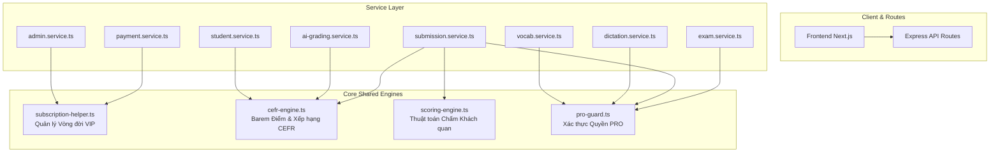

# TÀI LIỆU THIẾT KẾ CHI TIẾT KIẾN TRÚC BACKEND CORE MODULES
**Dự án:** Hệ thống Luyện thi & Khảo thí Trực tuyến Aptis ESOL  
**Phiên bản:** 2.0 (Cập nhật chuẩn hóa Kiến trúc Backend & Logic Dùng Chung)  
**Tác giả:** Đội ngũ Kỹ thuật Aptis Kỳ Tích  
**Trạng thái:** ✅ ĐÃ TRIỂN KHAI VÀ KIỂM THỬ THÀNH CÔNG 100%

---

## 1. TỔNG QUAN VÀ MỤC TIÊU KIẾN TRÚC

Trong quá trình vận hành và kiểm tra hệ thống, qua việc rà soát từng dòng mã nguồn thực tế (tuyệt đối không phỏng đoán, suy diễn), chúng tôi xác định 4 điểm nghẽn kiến trúc cốt lõi cần bóc tách để đảm bảo tính ổn định, dễ bảo trì và mở rộng lâu dài:



---

## 2. BẢNG ĐỐI CHIẾU HIỆN TRẠNG & GIẢI PHÁP MÃ NGUỒN

| # | Hạng mục | Vị trí mã nguồn ban đầu | Hệ quả thực tế trước khi sửa | Giải pháp kiến trúc mới | Trạng thái |
| :-: | :--- | :--- | :--- | :--- | :-: |
| **1** | **Vòng đời Gói cước VIP** | Phân mảnh tại `payment.service.ts` và 3 hàm trong `admin.service.ts` | Trùng lặp thuật toán cộng dồn hạn VIP (`Math.max(Date.now(), sub.end_date)`), dễ bất đồng bộ số lượt AI | Tách **`subscription-helper.ts`** làm hạt nhân xử lý vòng đời VIP | ✅ Đã hoàn thành |
| **2** | **Barem Điểm & Cấp độ CEFR** | • `submission.service.ts:L300-305`<br>• `ai-grading.service.ts:L439-442`<br>• `student.service.ts:L115, L302` | • Điểm 37: Trắc nghiệm xếp B1, AI xếp B2.<br>• `student.service.ts` thiếu `C1` làm `indexOf('C1') = -1`, sai bảng xếp hạng Dashboard. | Tách **`cefr-engine.ts`** làm nguồn chân lý duy nhất cho thang điểm và xếp hạng | ✅ Đã hoàn thành |
| **3** | **Thuật toán Chấm Trắc nghiệm** | • `submission.service.ts:L264-286` | Logic bóc tách JSON mảng `SENTENCE_ORDER` bị nhúng sâu trong transaction DB, không thể unit test độc lập | Tách **`scoring-engine.ts`** dạng Pure Function | ✅ Đã hoàn thành |
| **4** | **Bảo vệ Nội dung PRO** | • `dictation.service.ts:L95`<br>• `vocab.service.ts:L384` | Schema DB có `is_free`, nhưng API chi tiết bài học không kiểm tra quyền, người dùng thường xem được bài PRO | Tích hợp **`assertProAccess`** + **`optionalAuthGuard`** vào Dictation & Vocab | ✅ Đã hoàn thành |

---

## 3. THIẾT KẾ CHI TIẾT TỪNG MODULE CỐT LÕI

### 3.1. Module Vòng Đời VIP: `backend/src/utils/subscription-helper.ts`
- **Mục đích:** Tính toán chính xác thời hạn gia hạn và cộng dồn lượt chấm AI cho học viên theo quy tắc cộng dồn liên tục.
- **Quy tắc Nghiệp vụ:**
  1. Nếu người dùng đang có gói cước còn hạn (`end_date > now`): Thời hạn mới = `end_date cũ + durationDays`.
  2. Nếu người dùng chưa từng mua hoặc gói cước đã hết hạn: Thời hạn mới = `now + durationDays`.
  3. Lượt AI được cộng dồn theo gói hoặc bảo toàn lượt còn lại nếu gia hạn.
- **Hàm cốt lõi:**
  ```typescript
  export async function activateOrExtendSubscription(
    tx: Prisma.TransactionClient,
    input: SubscriptionGrantInput
  ): Promise<UserSubscription>
  ```
- **Tích hợp:** 
  - `payment.service.ts`: Webhook thanh toán tự động SePay.
  - `admin.service.ts`: `resolveManualTransaction`, `manualGrantVip`, `extendVip`.

---

### 3.2. Module Barem CEFR: `backend/src/utils/cefr-engine.ts`
- **Mục đích:** Thống nhất thang quy đổi điểm thi Aptis ESOL sang khung chuẩn Châu Âu và so sánh thứ hạng cấp bậc.
- **Barem chuẩn hóa Aptis ESOL 2026 (Thang điểm 0 - 50 cho từng kỹ năng):**
  - **C1 / C2:** 42 – 50 điểm *(Thành thạo cao cấp)*
  - **B2:** 36 – 41 điểm *(Độc lập / Đạt chuẩn đầu ra Đại học & Cao học)*
  - **B1:** 26 – 35 điểm *(Đạt chuẩn B1 Vstep / B1 Aptis)*
  - **A2:** 16 – 25 điểm *(Sơ cấp nâng cao)*
  - **A1:** 10 – 15 điểm *(Sơ cấp)*
  - **A0:** 0 – 9 điểm *(Chưa đạt chuẩn)*
- **Bảng cấp độ chuẩn:** `CEFR_ORDER = ['A0', 'A1', 'A2', 'B1', 'B2', 'C1', 'C2']`.
- **Hàm cung cấp:**
  - `scoreToCefr(score: number, maxScore: number = 50): CefrLevel`
  - `compareCefr(a: string | null, b: string | null): number`
  - `getCefrRank(level: string | null): number`
  - `normalizeCefrLevel(level: string | null): CefrLevel | null` (Tự động chuẩn hóa `'C'` thành `'C1'`).
  - `getHighestCefr(levels: (string | null)[]): string`
- **Tích hợp:**
  - `submission.service.ts`: Quy đổi điểm chấm trắc nghiệm Listening & Reading.
  - `ai-grading.service.ts`: Quy đổi điểm chấm tự luận Writing & Speaking (cả nhánh AI lẫn nhánh fallback).
  - `student.service.ts`: So sánh cấp độ cao nhất (`highestCefr`) và tìm cấp độ phổ biến nhất (`modeBand`) trên Dashboard học viên.

---

### 3.3. Module Chấm Điểm Thuần: `backend/src/utils/scoring-engine.ts`
- **Mục đích:** Tách biệt toán học chấm điểm ra khỏi tầng cơ sở dữ liệu để dễ dàng unit test và bảo trì.
- **Hàm cốt lõi:**
  ```typescript
  export interface GradeResult {
    score: number;
    isCorrect: boolean;
    userNormalizedAnswer: string;
  }

  export function gradeObjectiveQuestion(
    type: QuestionType,
    correctAnswer: string | null | undefined,
    userAnswer: string | null | undefined,
    maxScore: number = 1
  ): GradeResult;
  ```
- **Xử lý đặc thù `SENTENCE_ORDER`:**
  - Parse JSON mảng vị trí câu của học sinh và đáp án giáo viên.
  - So khớp từng vị trí `user[i] === correct[i]`.
  - Tính điểm theo tỷ lệ câu đúng: `Math.round((matched / total) * maxScore)`.
  - Có cơ chế bắt lỗi an toàn (fallback) nếu dữ liệu gửi lên là chuỗi đơn.

---

### 3.4. Module Kiểm Soát Quyền PRO: `backend/src/utils/pro-guard.ts`
- **Mục đích:** Đảm bảo toàn vẹn doanh thu hệ thống, ngăn chặn học viên thường hoặc khách vãng lai gọi trộm tài nguyên PRO.
- **Quy tắc phân quyền:**
  1. Chưa đăng nhập (`userId == null`): Lập tức trả về mã lỗi `403 Forbidden` (`requirePro: true`).
  2. Tài khoản quản trị & giảng dạy (`SUPER_ADMIN`, `ADMIN`, `TEACHER`): Miễn trừ kiểm tra VIP, có quyền truy cập toàn bộ tài nguyên.
  3. Học viên (`STUDENT`): Bắt buộc phải có bản ghi `UserSubscription` còn hạn (`is_active = true`, `end_date > now`).
- **Phạm vi bảo vệ:**
  - Đề thi PRO: `exam.service.ts` & `submission.service.ts`.
  - Nghe chép chính tả PRO: `dictation.service.ts` (`getLessonDetail`).
  - Bộ từ vựng PRO: `vocab.service.ts` (`getSetWords`).
  - Kết hợp với `optionalAuthGuard` ở tầng route để trích xuất `userId` mà không làm sập các bài học miễn phí.

---

## 4. KẾT QUẢ KIỂM THỬ VÀ XÁC MINH HỆ THỐNG

### 4.1. Kiểm thử TypeScript Compiler
- **Backend:** `npx tsc --noEmit` -> **Exit Code: 0** (100% sạch lỗi kiểu dữ liệu).
- **Frontend:** `npx tsc --noEmit` -> **Exit Code: 0** (100% tương thích).

### 4.2. Kiểm thử Tích hợp Subscription Helper
- Script thực nghiệm: `backend/scripts/test-subscription-helper.ts`.
- Kịch bản: Tạo gói mới -> Gia hạn liên tục khi còn hạn -> Tự động khôi phục dữ liệu (Rollback).
- Kết quả: **100% Passed**.

### 4.3. Kiểm thử Barem CEFR
- Điểm 45: Trả về `C1`.
- Điểm 37: Trả về `B2`.
- Điểm 28: Trả về `B1`.
- Điểm 18: Trả về `A2`.
- Điểm 12: Trả về `A1`.
- Thứ tự: `compareCefr('C1', 'B2') > 0`, `compareCefr('C1', 'C') === 0`.
- Dashboard học viên hiển thị chuẩn xác cấp độ `C1` mà không bị trả về `-1`.
